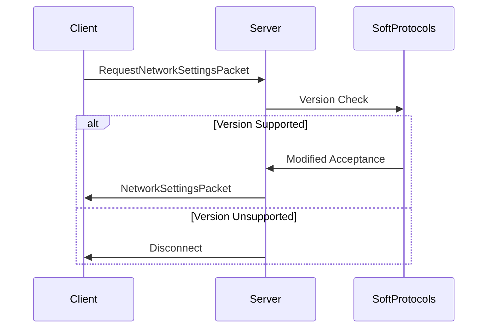

<div align="center">
<h1>🌐 SoftProtocols - Protocol Version Compatibility Plugin</h1>

<p align="center">
A lightweight PocketMine-MP plugin that <strong>exclusively handles protocol version compatibility</strong> during the initial handshake, allowing players with slightly different Minecraft Bedrock versions to connect while maintaining all other packet behaviors unchanged.

[](https://poggit.pmmp.io/p/SoftProtocols) [](https://poggit.pmmp.io/p/SoftProtocols) [](https://poggit.pmmp.io/p/SoftProtocols) [](LICENSE) [](https://discord.gg/EEJK2vxtCp) 

</p>

</div>

---

## 🚀 Key Feature

> [!WARNING]
> **Protocol Handshake Only**  
> This plugin only modifies the version negotiation process during the **initial handshake**.  
> It does **not** touch gameplay packets, compression, or encryption.

---

## 🧩 Supported Protocol Versions

| Protocol | Minecraft Version     | Notes             |
|----------|------------------------|-------------------|
| 860      | 1.21.124                | Primary Supported |
| 859      | 1.21.120 – 1.21.123      | Minor Extension   |

---

## ⚙️ How It Works

1. Intercepts only the `RequestNetworkSettingsPacket` (handshake)
2. Validates against configured protocol versions
3. Modifies **only the version check** while keeping:
   - All other packet handling intact
   - Original compression settings
   - Standard encryption flow
   - Unchanged gameplay behavior



---

## 📥 Installation

1. Download the latest `SoftProtocols.phar`
2. Place it inside your `/plugins/` folder
3. Restart your PocketMine-MP server

---

## 📌 Important Notes

> [!IMPORTANT]
> ⚠ This is **not a full version compatibility layer**
> SoftProtocols does **not** handle:
>
> * Packet structure changes
> * Gameplay mechanics or feature parity
> * Block/entity/item remapping

> [!TIP]
> ✅ Recommended Use Case:
>
> * For minor version differences (e.g., 1.21.90 ↔ 1.21.93)
> * When client/server features are almost identical

---

## 🛠 Configuration

Edit the supported protocols in `config.yml`:

```yaml
## SoftProtocols Configuration ##
supported-protocols:
- 860 # v1.21.124
- 859 # v1.21.120 - v1.21.123
```

---

## 💖 Support Development

If you find my PocketMine-MP plugins useful and wish to support their ongoing development and maintenance, your contributions are greatly appreciated. Your generosity enables me to dedicate more time and resources to improving and expanding the functionality of these plugins for the benefit of the community.

### How to Contribute

You can support this project in several ways:

- 💰 **Financial Contributions**: Donations are welcome via [PayPal](https://paypal.me/FireRashkar). Your financial support helps cover hosting costs, development tools, and other expenses associated with maintaining this project.
  
- 📝 **Feedback and Suggestions**: Your feedback is invaluable in shaping the future direction of these plugins. Whether you encounter a bug, have an idea for a new feature, or simply want to share your thoughts, please don't hesitate to open an issue or reach out to me directly.
  
- 💻 **Code Contributions**: If you're a developer and would like to contribute to the codebase, pull requests are always welcome.
  
### Acknowledgements

I would like to express my heartfelt gratitude to all the individuals and organizations who have supported this project through their contributions, be it through code, financial donations, or valuable feedback. Your support keeps this project alive and thriving.

Thank you for your continued support and encouragement!

---

## 🧑‍💻 Need Help?

If you're experiencing issues, please open a GitHub issue and include:

* Minecraft client version
* PocketMine-MP version
* Console output or crash log (if any)